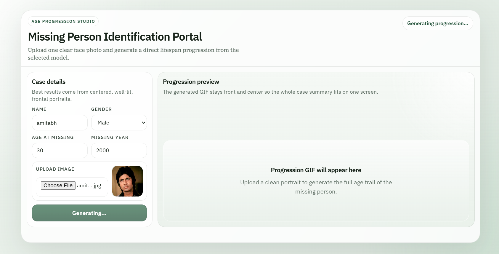
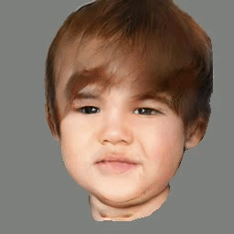

````markdown
<p align="center">
  
</p>

<h1 align="center">Missing Person Identification Portal</h1>

<p align="center">
  AI-powered age progression system for missing person identification using GAN-based face aging.
</p>

<p align="center">
  <b>Next.js</b> • <b>FastAPI</b> • <b>Express.js</b> • <b>MongoDB</b> • <b>PyTorch</b>
</p>

---

## Overview

The **Missing Person Identification Portal** is a full-stack AI-powered web application designed to assist in **missing person identification through age progression**.

The system takes a **single facial image** of a missing individual and generates a **realistic age-progression sequence** using a GAN-based face aging model derived from the **Lifespan Age Transformation Synthesis (LATS)** framework.

It combines:

- **modern web interface** for case input
- **real-time inference pipeline**
- **historical dashboard tracking**
- **GIF-based age progression visualization**
- **MongoDB case history storage**

This project is especially useful for:
- law enforcement support systems
- missing child identification
- research demonstrations
- academic projects on GANs and face aging

---

## Key Features

- 🎯 GAN-based face age progression
- 🎥 Animated age transition GIF generation
- 📊 Dashboard for historical upload tracking
- ⚡ FastAPI inference backend
- 🧠 LATS-based identity-preserving aging
- 🔄 Async non-blocking MongoDB logging
- 🚀 Production-ready modular architecture
- 👨 Male/Female model checkpoint support

---

## Application Preview

<p align="center">
  
</p>

---

## Model Output Example

<table>
  <tr>
    <td align="center">
      
      <br>
      <b>Input Image</b>
    </td>
    <td align="center">
      
      <br>
      <b>Age Progression Output</b>
    </td>
  </tr>
</table>

---

## Project Architecture

```text
Missing_PersonPortal/
├── backend/
│   ├── model/             # FastAPI inference service
│   ├── dashboard/         # Express + MongoDB backend
│   ├── model_runtime/     # GAN runtime + checkpoints
│   └── shared/            # Shared utilities/config
│
├── frontend/              # Next.js frontend
├── assets/                # README/UI assets
├── testData/              # Sample test images
└── README.md
````

---

## System Workflow

```text
User Upload
   ↓
Next.js Frontend
   ↓
FastAPI Backend
   ↓
LATS GAN Runtime
   ↓
Age Progression GIF + Image Strip
   ↓
Dashboard Logging (MongoDB)
   ↓
Historical Case Records
```

---

## Model Architecture

```text
Input Face
   ↓
Identity Encoder
   ↓
Latent Feature Space
   ↓
Age Transformation Module
   ↓
Decoder / Generator
   ↓
Aged Face Output
```

The model performs **identity-preserving latent age transformation** by traversing learned age anchors.

---

## Core Loss Functions

### GAN Loss

Ensures realistic image generation.

$$
L_{GAN}
$$

---

### Identity Loss

Preserves the identity of the same person.

$$
L_{id} = ||E(x) - E(G(x,a)||_2
$$

---

### Cycle Consistency Loss

Ensures reversible transformation.

$$
L_{cycle} = ||x - G(G(x,a_1),a_0)||_1
$$

---

### Reconstruction Loss

Preserves image when age remains unchanged.

$$
L_{rec} = ||x - G(x,a)||_1
$$

---

## Tech Stack

### Frontend

* Next.js
* TypeScript
* React
* CSS

### Backend

* FastAPI
* Python
* PyTorch

### Dashboard

* Express.js
* MongoDB
* Mongoose

### AI Model

* GAN
* LATS (ECCV 2020)

---

## Installation

### Backend (Model API)

```bash
cd backend
pip install -r requirements.txt
uvicorn model.app:app --reload --host 127.0.0.1 --port 8000
```

Health check:

```text
http://127.0.0.1:8000/health
```

---

### Frontend

```bash
cd frontend
npm install
npm run dev
```

Open:

```text
http://localhost:3000
```

---

### Dashboard Backend

```bash
cd backend/dashboard
npm install
npm run dev
```

Dashboard:

```text
http://localhost:3000/dashboard
```

---

## API Endpoints

### Health Check

```http
GET /health
```

---

### Model Status

```http
GET /model-status
```

---

### Predict Age Progression

```http
POST /predict
```

#### Input

* name
* gender
* age_at_missing
* missing_year
* image

#### Output

* progression image
* GIF
* predicted current age
* output paths

---

## Performance

| Mode | Approx Time |
| ---- | ----------- |
| CPU  | 30–60 sec   |
| GPU  | 5–10 sec    |

---

## Known Limitations

* works best on frontal face images
* blurry images reduce quality
* CPU inference is slower
* requires valid checkpoints
* dashboard requires MongoDB

---

## Research Base

Based on:

**Lifespan Age Transformation Synthesis**
Roy Or-El et al.
ECCV 2020

---

## Future Improvements

* webcam integration
* face recognition matching
* police case dashboard
* cloud deployment
* multi-person identification

---

## Author

Developed as an AI-powered **Missing Person Identification and Face Aging System** project using GANs and full-stack deployment.

```
```
