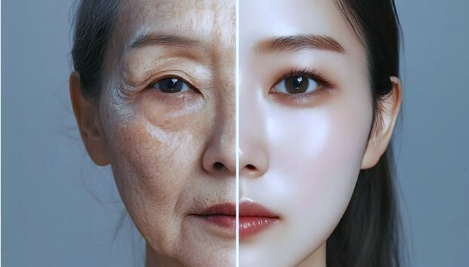

<p align="center">
  
</p>

# Missing Person Portal
A full-stack missing-person age-progression demo built with Next.js and FastAPI on top of a GAN-based face-aging runtime.

The core age-transformation runtime in this project is adapted from the `Lifespan_Age_Trans` repository in this workspace, based on the official Lifespan Age Transformation Synthesis project by Roy Or-El et al.

The app accepts a face photo plus model selection metadata, runs the upstream Lifespan Age Transformation Synthesis model directly, and returns:

- a full progression GIF across age buckets
- a full progression strip generated from the uploaded image itself

## Project structure

```text
missing-person-portal/
├─ backend/
│  ├─ app/                  # FastAPI application
│  ├─ model_runtime/        # Face-aging model runtime and checkpoints
│  └─ requirements.txt
├─ frontend/                # Next.js web client
├─ testData/                # Sample input photos for local testing
├─ package.json             # Repo-level helper scripts
└─ README.md
```

## Features

- Next.js frontend for collecting upload and model-selection details
- FastAPI backend for validation and inference orchestration
- local model-status detection for male and female checkpoints
- generated age-progression GIF output
- generated full progression strip output
- sample test images for quick smoke testing
- repo-level scripts and ignore rules for cleaner GitHub usage

## Attribution

- Core aging model source: `Lifespan_Age_Transformation_Synthesis/`
- Original project: Lifespan Age Transformation Synthesis
- Authors: Roy Or-El, Soumyadip Sengupta, Ohad Fried, Eli Shechtman, Ira Kemelmacher-Shlizerman
- Paper: ECCV 2020

## Upstream Assets

The portal can automatically reuse the original upstream `in_the_wild` alignment assets from either of these locations:

- `missing-person-portal/backend/model_runtime/`
- sibling repo: `../Lifespan_Age_Trans/`

If present, the backend will look for:

- `util/shape_predictor_68_face_landmarks.dat`
- `deeplab_model/deeplab_model.pth`
- `deeplab_model/R-101-GN-WS.pth.tar`

You can also override the asset location with `LATS_ASSET_ROOT`.

## What changed in this version

- portal inference now runs from the upstream `Lifespan_Age_Transformation_Synthesis` repo in this workspace
- portal GIF generation uses traversal output, and the still preview uses the upstream full-progression deploy output
- when the original in-the-wild alignment assets are available locally, the portal can reuse that higher-quality preprocessing path
- frontend focuses on direct image-driven progression rather than picking a target age band from missing-person metadata
- backend dependency list now includes the model runtime packages that were previously missing

## LATS Model Architecture

```text
Input Face
   ↓
Identity Encoder : Extracts identity (latent identity features) using encoder
   ↓
Latent Feature Space : z=[identity features]
   ↓
Age Transformation Module : This is where target age is injected. The model uses fixed anchor age classes: 0-70
(Ensures continuous traversal in latent space)
   ↓
Decoder / Generator : Outputs probability.
   ↓
Aged Face Output
```
### Loss functions

1) GAN Loss: Ensures the generated face looks realistic and indistinguishable from a real face.

$$
L_{GAN}
$$

2) Identity Loss : This is the most critical loss for viva because it preserves the same person’s identity across age transformation.
$$
L_{id} = \left\| E(x) - E(G(x,a)) \right\|_2
$$

3) Cycle Loss: This ensures reversibility of age transformation.For example:child → adult → child
The output should reconstruct the original image.

$$
L_{cycle} = \left\| x - G(G(x,a_1),a_0) \right\|_1
$$

4) Self Reconstruction Loss: If the target age is the same as the source age, the image should reconstruct itself.

$$
L_{rec} = \left\| x - G(x,a) \right\|_1
$$

## Requirements

- Python 3.11 recommended
- Node.js 18 or newer
- npm 9 or newer

## Setup

### 1. Backend

```powershell
cd backend
python -m pip install -r requirements.txt
python -m uvicorn app.main:app --reload --host 127.0.0.1 --port 8000
```

Health check:

```text
http://127.0.0.1:8000/health
```

### 2. Frontend

```powershell
cd frontend
copy .env.local.example .env.local
npm install
npm run dev
```

Open:

```text
http://localhost:3000
```

### 3. Optional repo-root helpers

From the repository root:

```powershell
npm run dev:frontend
npm run dev:backend
```

## Environment variables

### Frontend

`frontend/.env.local.example`

```env
NEXT_PUBLIC_API_URL=http://localhost:8000
```

### Backend

- `FRONTEND_ORIGIN`
  Comma-separated allowed origins for CORS. Defaults to local Next.js addresses.

## API

### `POST /predict`

Also available at `POST /api/predict` for compatibility with API-prefixed clients.

Multipart form fields:

- `name` - required string
- `image` - required image file
- `gender` - optional, `male` or `female`
- `age_at_missing` - required integer (0-120)
- `missing_year` - required integer (1900-current year)

Successful responses include:

- `age_at_missing`
- `missing_year`
- `current_age` (calculated as `age_at_missing + current_year - missing_year`)
- `progression_image_base64`
- `progress_gif_base64`
- `progression_image_path`
- `progress_gif_path`

## Model checkpoints

The portal looks for checkpoints in either of these locations:

- `Lifespan_Age_Transformation_Synthesis/checkpoints/`
- `backend/model_runtime/checkpoints/`

Male and female models are available when the corresponding folders exist:

- `males_model/`
- `females_model/`

## Known limitations

- The model still traverses learned age anchors internally, but the portal no longer asks the user to target a specific age band.
- Output quality depends heavily on a clean, frontal, well-lit face image.
- If the original `dlib` and Deeplab alignment assets are missing, uploaded images fall back to the lightweight neutral-mask path instead of the full upstream in-the-wild preprocessing pipeline.
- Inference can be slow on CPU.

## Notes for contributors

- Generated images, temporary uploads, and model result folders are ignored by Git.
- The model checkpoint weights are large; if you publish this publicly, consider moving weights to a release asset or external storage instead of committing them directly.
